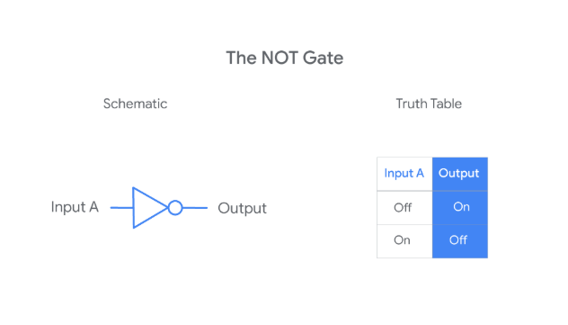
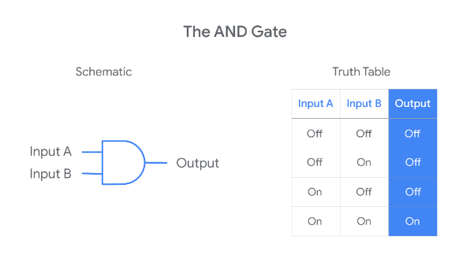
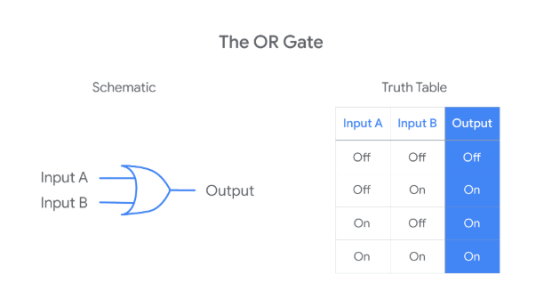
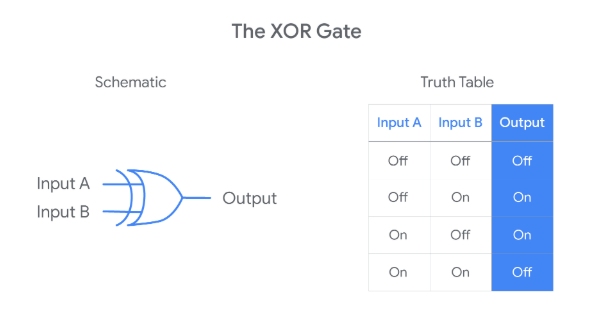
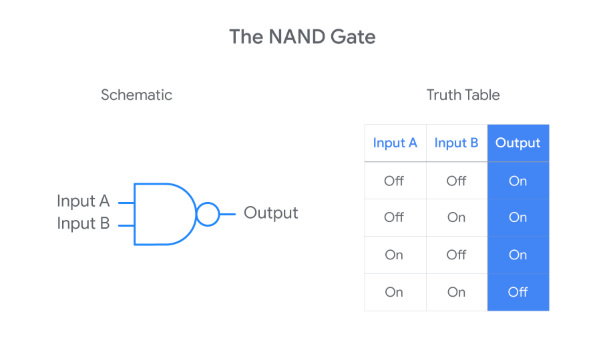
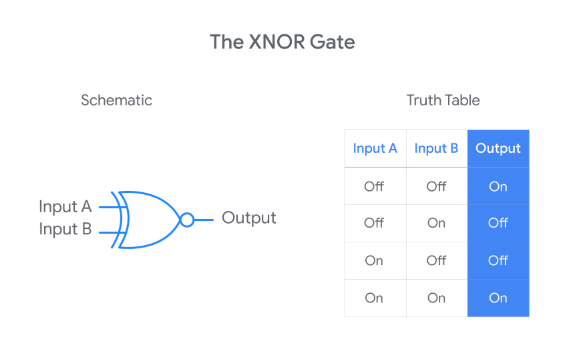
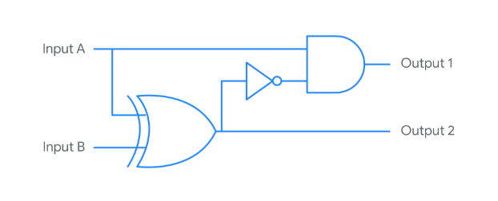
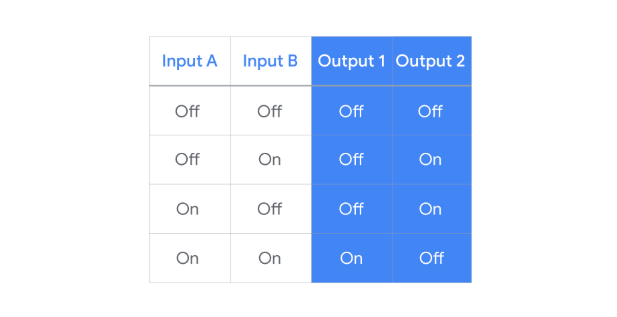

<h1>Supplemental Reading on Logic Gates</h1>

Knowing how logic gates work is important to understanding how a computer works. Computers work by performing binary calculations. <b>Logic gates</b> are electrical components that tell a computer how to perform binary calculations. They specify rules for how to produce an electrical output based on one or more electrical inputs. Computers use these electrical signals to represent two binary states: either an “on” state or an “off” state. A logic gate takes in one or more of these binary states and determines whether to pass along an <i>“on”</i> or <i>“off” signal.</i>

Several logic gates have been developed to represent different rules for producing a binary output. This reading covers six of the most common logic gates. 

<h2>Six Common Logic Gates</h2>

1. <b>NOT Gate</b> - The NOT gate is the simplest because it has only one input signal. The NOT gate takes that input signal and outputs a signal with the opposite binary state. If the input signal is “on,” a NOT gate outputs an “off” signal. If the input signal is “off,” a NOT gate outputs an “on” signal. All the logic gates can be defined using a schematic diagram and truth table. Here’s how this logic rule is often represented:



- On the left, you have a schematic diagram of a NOT gate. Schematic drawings usually represent a physical NOT gate as a triangle with a small circle on the output side of the gate. To the right of the schematic diagram, you also have a “truth table” that tells you the output value for each of the two possible input values.

2. <b>AND Gate</b> - The AND gate involves two input signals rather than just one. Having two input signals means there will be four possible combinations of input values. The AND rule outputs an “on” signal only when both the inputs are “on.” Otherwise, the output signal will be “off."



3. <b>OR Gate</b> - The OR gate involves two input signals. The OR rule outputs an “off” signal only when both the inputs are “off.” Otherwise, the output signal will be “on.”



4. <b>XOR Gate</b> - The XOR gate also involves two input signals. The XOR rule outputs an “on” signal when only one (but not both) of the inputs are “on.” Otherwise, the output signal will be “off.”



- The truth tables for XOR and OR gates are very similar. The only difference is that the XOR gate outputs an “off” when both inputs are “on” while the OR outputs an “on.” Sometimes you may hear the XOR gate referred to as an “exclusive OR” gate.

5. <b>NAND Gate</b> - The NAND gate involves two input signals. The NAND rule outputs an “off” signal only when both the inputs are “on.” Otherwise, the output signal will be “on.”



- If you compare the truth tables for the NAND and AND gates, you may notice that the NAND outputs are the opposite of the AND outputs. This is because the NAND rule is just a combination of the AND and NOT rules: it takes the AND output and runs it through the NOT rule! For this reason, you might hear the NAND referred to as a “not-AND” gate.

6. <b>XNOR Gate</b> - Finally, consider the XNOR gate. It also involves two input signals. The XNOR rule outputs an “on” signal only when both the inputs are the same (both “On” or both “Off”). Otherwise, the output signal will be “off.”



- The XNOR rule is another combination of two earlier rules: it takes the XOR output and runs it through the NOT rule. For this reason, you might hear the XNOR referred to as a “not-XOR” gate.

<h2>Combining Gates (Building Circuits)</h2>

Logic gates are physical electronic components—a person can buy them and plug them into a circuit board. Logic gates can be linked together to create complex electrical systems (circuits) that perform complicated binary calculations. You link gates together by letting the output from one gate serve as an input for another gate or by using the same inputs for multiple gates. Computers are this kind of complex electrical system. 

Here’s a schematic drawing for a small circuit built with gates described above:



Here is the truth table for this circuit:



This circuit uses three logic gates: an XOR gate, a NOT gate, and an AND gate. It takes two inputs (A and B) and produces two outputs (1 and 2). A and B are the inputs for the XOR gate. The output of that gate became the input of the NOT gate. Then, the output of the NOT gate became an input for the AND gate (with input A as the other). Output 1 is the output from the AND gate. Output 2 is the output from the XOR gate. 

<h2>Key Takeaways</h2>

Logic gates are the physical components that allow computers to make binary calculations.

```
- Logic gates represent different rules for taking one or more binary inputs and outputting a specific binary value (“on” or “off”).
- Logic gates can be linked so that the output of one gate serves as the input for other gates.
- Circuits are complex electrical systems built by linking logic gates together. Computers are this kind of complex electrical system.
```