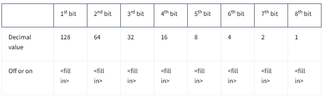
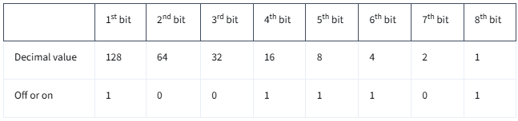
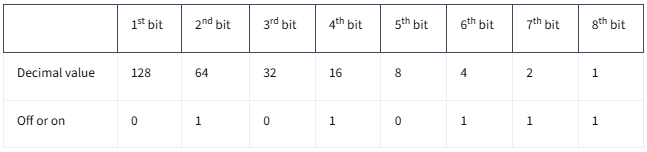
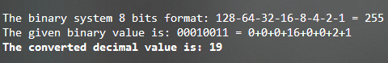
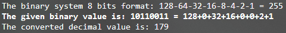
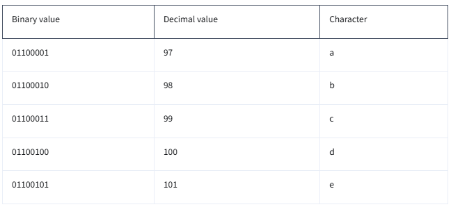

<h1>Binary Conversion</h1>

Decimal values, binary values, and characters are all used to communicate information. Computers receive and communicate information with binary values, so the binary system shapes the rules and conventions of how computers interact with one another. Being able to convert binary values to decimal values or characters will help you better understand IT infrastructure and computer networking. In this reading, you’ll learn more about converting between decimal values, binary values, and characters. You’ll also practice using a binary conversion table. 

<h2>Use a Table to convert between decimal and binary</h2>

- By convention, decimal numbers are represented with 8 bits (1 byte) in binary. Each bit is either a 0 or a 1, so 28 = 256 decimal numbers can be represented with 1 byte. Additionally, each bit represents a specific decimal value based on its order in the byte. The 1st (leftmost) bit is 128, and each bit after that is half the value of the previous one. 

You can use a conversion table, like the one that follows, to convert from decimal to binary, and vice versa: 

- In this table, the “Decimal value” row displays the decimal value of each bit in the byte. For example, the 3rd bit has a value of 32 and the 8th bit has a value of 1. To use this table for a conversion, the “Off or on” row is filled to indicate if a bit is off (0) or on (1). Then, the numbers in the “Decimal value” rows that have a 1 in the “Off or on” row of the same column are added together to get the decimal value of the byte. 

This might seem complicated, but it just takes some practice! In the next sections, you’ll use this table to convert from binary to decimal values and from decimal to binary values. 

<h3>Convert from binary to decimal values</h3>

- To use the table to convert from binary to decimal values, enter the byte you want to convert into the “Off or on” row. For example, to convert the byte 10011101 to a decimal value, fill the “Off or on” row with the values of each bit in the byte, like this: 

In this example, 128 + 16 + 8 + 4 + 1 = 157. Therefore, the decimal value represented by the binary number 10011101 is 157.

<h3>Convert from decimal to binary values</h3>

- To use this table to convert from a decimal value to a binary value, put 0s and 1s in the “Off or on” row of the table so that the sum of the decimal values of any columns that contain a 1 in the “Off or on” row  add up to the decimal value. For example, to convert the decimal value 87 to binary, you’d fill out the table like this: 

The sum of 64 + 16 + 4 + 2 + 1 is 87, so the binary value that represents 87 is 01010111.

<h3>Try it yourself!</h3>

Now, practice on your own by completing the following practice problems:

1. Use the binary conversion table to convert the binary value 00010011 into a decimal value. 

2. Use the binary conversion table to convert the decimal value 179 into a binary value. 

Navigate to the end of this reading to check your answers.

<h2>Character encodingL From binary values to characters</h2>

As you learned earlier in this lesson, character encoding assigns binary values to characters so that humans can read them. The American Standard Code for Information Interchange (ASCII) was the first character encoding standard used. It uses one byte to represent each character in the English alphabet, digits, and punctuation. Each byte maps to a specific character, so ASCII can only represent 256 characters. The following table displays the ASCII table for the first 5 lowercase letters in the English alphabet: 

UTF-8 is a newer standard that uses the same ASCII character encodings but allows characters to be represented with more than one byte. This allows many more characters–and even emojis–to be represented with binary. 

<h3>Key Takeaways</h3>

Computers communicsate using binary, so it is important for IT support specialists to understand how binary works and to be able to convert binary values into both decimal values and characters. You can use a binary conversion table to help you convert between decimal and binary values. You can use an ASCII or UTF-8 table to convert from binary or decimal values into characters. 
