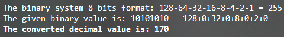
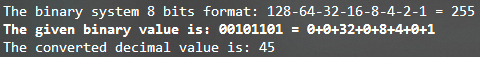

<h1>Test Your Knowledge: Binary</h1>

1. How many possible values can we have with the 8 bits in a byte?

- 127
- <b>256</b>
- 8
- 144

Since there are 8 bits with two values each, the highest number of possible values is 2 to the power of 8, or 256. 

2. What is the highest decimal value a byte can represent?

- 1
- <b>255</b>
- 256
- Any number

There are 256 values in a byte, from the decimal number 0 to 255, which is the highest value since the count starts at 0. 

3. Why did UTF-8 replace the ASCII character-encoding standard?

- UTF-8 only uses 128 values.
- ASCII can store emojis.
- ASCII can store a character in more than one byte. 
- <b>UTF-8 can store a character in more than one byte.</b>

UTF-8 replaced the ASCII character-encoding standard because it can store a character in more than a single byte. 

4. What is 10101010 in decimal format? Please use this Binary Table to find the answer.

- 200
- 48
- 160
- <b>170</b>

5. What is 45 in binary form? Please use this Binary Table to find the answer.

- 00111011
- <b>00101101</b> 
- 10000010
- 01001001