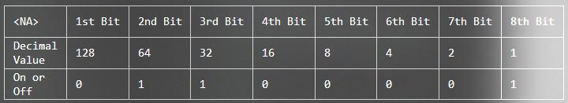
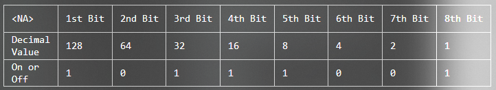
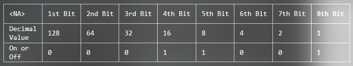

<h1>Module 1 Challenge: Introduction To IT And Computing</h1>

1. Which of these tasks may be part of an IT support specialist role? Select all that apply. 

- <b>Ensure that an organization’s technological equipment is running smoothly.
- Communicate with technology users to understand their challenges and needs.
- Implement security to make sure your organization’s systems are safe. 
- Fix or troubleshoot problems related to technological equipment.</b>

2. What is a computer? Select the best answer

- A device that uses bits to display information to a user.
- A machine can connect to the internet.
- A machine that can store and display images and graphics.
- <b>A device that stores and processes data by performing calculations.</b>

3. Which of these devices were used to store data in computers in the past but typically are no longer used? Select all that apply.

- <b>Punch cards</b>
- <b>Floppy disks</b>
- Transistors
- Hard disk drives

4. Fill in the blank: One byte can encode ___ unique values.

- 100
- 2560
- 8
- <b>256</b>

5. Fill in the blank: ____ is used to assign characters to binary values so humans can read them.

- Compilation
- RGB
- Refactoring
- <b>Character encoding</b>

6. Fill in the blank: In a binary system, an electrical signal indicates a value of ___.

- 0
- <v>1</b>
- 2
- 10

7. Use the following binary conversion table to convert the decimal value 97 into binary format. 

Calculation:

The binary system 8 bits format: 128-64-32-16-8-4-2-1 = 255
The given binary value is: <b>01100001 = 0+64+32+0+0+0+0+1</b>
The converted decimal value is: 97

- 01011101
- 01001101
- <b>01100001</b>
- 01101101

8. Use the following binary conversion table to convert the byte 10111001 into a decimal value. 

Calculation:

The binary system 8 bits format: 128-64-32-16-8-4-2-1 = 255
The given binary value is: 10111001 = 128+0+32+16+8+0+0+1
<b>The converted decimal value is: 185</b>

- 159
- 188
- 214
- <b>185</b>

9. Use the following binary conversion table to convert the byte 00011001 into a decimal value. 

Calculation:

The binary system 8 bits format: 128-64-32-16-8-4-2-1 = 255
The given binary value is: 00011001 = 0+0+0+16+8+0+0+1
<b>The converted decimal value is: 25</b>

- 18
- 28
- <b>25</b>
- 24

10. Why is abstraction helpful when working with computers?

- <b>Abstraction takes a relatively complex system and breaks it apart into simpler ideas to make it easier to think about.</b>
- Abstraction takes a simple system and describes it in detail.
- Abstraction takes a relatively complex system and describes each part of the system in detail to improve your understanding.
- Abstraction explains each concept that’s “under the hood.”
