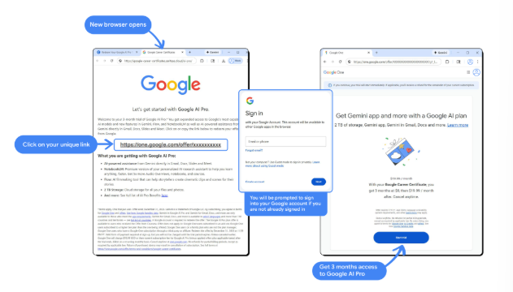

<h1>Get learning assistance with Google AI Pro at no cost</h1>

Earning a Career Certificate is a significant milestone. However, as you navigate the complex topics and projects included in this program over the coming months, you don’t have to do it alone. The Google AI Pro subscription gives you access to powerful AI tools to help you study faster, more effectively, and more efficiently.

<h3>Unlock your learning with 3 months of Google AI Pro at no cost</h3>

To support you through the program, we’re providing a complimentary three-month trial subscription to Google AI Pro. With it, you’ll gain higher access to a suite of our most capable AI models and features, ensuring you have the power you need to develop the new career skills you need for today’s job market.

With <b>Google AI Pro</b>, you can:

1. <b>Synthesize information:</b> Ask for summaries of readings or connections between concepts covered in multiple modules or courses.

2. <b>Bring AI into your workflow:</b> Work with Gemini directly inside Google Docs, Gmail, Slides, and Sheets to draft, organize, and visualize your work where it actually happens.

3. <b>Prepare for practice:</b> Use AI to simulate real-world scenarios or provide feedback on your professional communication skills.

4. <b>Stay organized:</b> Use AI to help draft study schedules, generate flow charts for complex topics, or add automations to your inbox. 

5. <b>Reinforce concepts:</b> Build flashcards, quizzes, mindmaps, and personalized podcasts to help deepen your understanding of course material.

<h3>How to access your extended trial</h3>

1. Proceed to the next item.

2. Select “I agree to use this app responsibly.”

3. Click the “Launch App” button.

4. Click your unique link (this link is unique to your account; please do not share).

5. Click “Start trial.”

6. Ensure you are signed into Gemini with your personal Google account.

<h3>Tips and reminders</h3>

- <b>Personal accounts:</b> This promotion is for personal Google Accounts. If you are currently signed into a Workspace (work or school) account, switch to your personal account to redeem.

- <b>Academic integrity:</b> Use AI Pro as a partner to help you learn and understand. Always ensure the work you submit for your certificate is your own.

- <b> Optional but impactful:</b> A Google AI Pro subscription is not required to complete this certificate, but it is highly recommended as a support system to help you stay on track and get the most out of your learning.

Ready to meet your learning partner? Proceed to the next item.