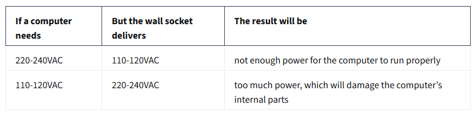
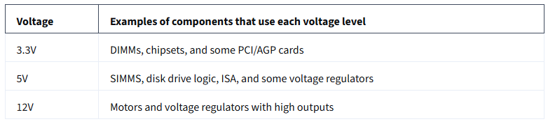

<h1>Power Supplies</h1>

In this reading, you will learn how to select the correct power supply for a personal computer (PC) to support the main components of the PC. 

As you learned in a previous video, computer systems require a direct current (DC) of electricity to operate. However, power companies deliver electricity in alternating currents (AC). AC power can damage the internal components of a computer. To solve this problem, computer power supplies are used to convert the AC from the wall socket to DC. Power supplies also reduce the voltage delivered to the computer’s internal components.

<h2>Computer architecture</h2>

Computer architecture refers to the engineering design of computers and the interconnecting hardware components that together create computing devices that meet functional, performance and cost goals. Power supplies are part of the hardware layer of a computer’s architecture. You learned earlier about the other major hardware components of a computer’s architecture, including the motherboard, chipsets, CPUs, RAM, storage, peripherals, expansion slots and cards, etc. These components influence the size and type of power supply a computer needs.

<h2>Selecting a power supply</h2>

<h3>Local input voltage</h3>

A main consideration when selecting a computer power supply is the voltage delivered to common wall sockets in your country. Power standards for input voltages can vary from country to country. The most common voltage inputs are 110-120 VAC and 220-240 VAC. VAC stands for volts of alternating current. 

- Voltages in the Americas

North, Central, and parts of South America use the 110-127 VAC standard for common wall sockets. Computers and power supplies sold in these regions are designed to use this level of power. 

- Voltages for most of the world

Most countries use the 220-240 VAC standard for common wall sockets. Computers and power supplies sold in these areas are designed to use this higher voltage. 

```
Please visit WorldStandards “Plug, socket & voltage by country” to find 
your country’s voltage standards.
```

It is important to use the correct voltage power supply or power converter for the computer’s voltage specifications. Imagine that you have a customer who imported a PC from a country that uses a different standard for input voltage. You will need to adapt the input power to protect the computer. Some options for doing this might include: 

- Replace the power supply with a unit that uses the appropriate voltage for the target country.

- Install a power supply model that includes a dual-voltage switch that can be toggled from 110-120VAC to 220-240VAC. 

- Plug the computer into an external power converter that then plugs into a normal wall socket. Power converters can be purchased from any store that sells international travel merchandise. 

Without a power converter, the following problems may be experienced:



<h3>Motherboard engineering specifications</h3>

The motherboard and form factor specifications document will provide a list of compatible power supply types to help you select the correct part. The ATX form factor is the most common motherboard design for full-sized, personal desktop computers. You may also find a version of the ITX form factor in smaller computers. The form factor size and components embedded in the motherboards will create a starting point for the minimum power supply wattages required.

<h3>Power consumption of components</h3>

The number of internal components and peripherals the computer will need to support will also determine the minimum wattage a power supply must provide. For example, a basic computer that is designed for word processing and surfing the Internet should work with a standard power supply. However, some computers may need higher wattage power supplies to support items like a powerful CPU, multiple CPUs, multiple hard drives, video rendering applications, a top-tier graphics processing unit (GPU) for gaming, and more. 

<h3>Voltages and pin connectors</h3>

The internal hardware components of a computer require varied input voltages to operate. Voltage regulators embedded in the motherboard of the computer control the amount of power that is delivered to the computer’s various internal components. 



The computer’s power supply plugs into an adapter on the computer’s motherboard. The wiring for this connection uses color coded wires. Each wire color carries a different voltage of electricity to the motherboard or serves as a grounding wire. A standard ATX motherboard power adaptor has either 20-pins or 24-pins to connect these wires. The 20-pin design is an older technology. The 24-pin connector was developed to provide more power to support additional expansion cards, powerful CPUs, and more. The 24-pin connector has become the standard for today’s personal computer power supplies and motherboards. 

The power supply will have multiple connectors that plug into the motherboard, hard drives, and graphic cards. Each cable has a specific purpose and delivers the appropriate amount of electricity to the following parts:

- Connections from a PC power supply (ATX 2)

- Floppy disk drive (obsolete)

- "Molex" universal (e.g. IDE hard drives, optical drives)

- SATA drives

- Graphics cards 8-pin, separable for 6-pin

- Graphics cards 6-pin

- Motherboard 8-pin

- Motherboard P4 connector, can be combined to 8-pin mainboard connector 12V

- ATX2 24-pin, divisible 20+4, and can therefore also be used for old 20-pin connections

- You will learn how to install a power supply and connect these power cables later in this module.

<h2>Key takeaways</h2>

When selecting a power supply for a computer, the following items should be taken into consideration:

- Wall socket input voltage standard for the country where the computer will be used;

- The number and power consumption needs of the computer’s internal components;

- The motherboard model and form factor engineering specifications and requirements.