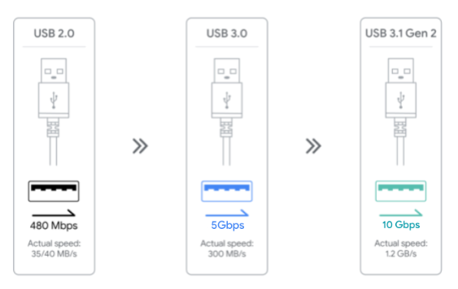
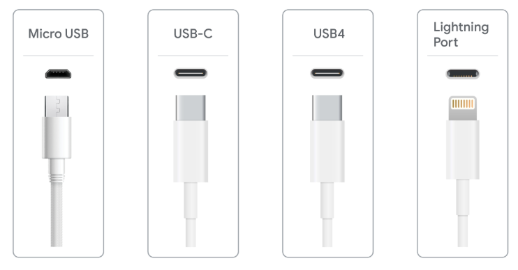
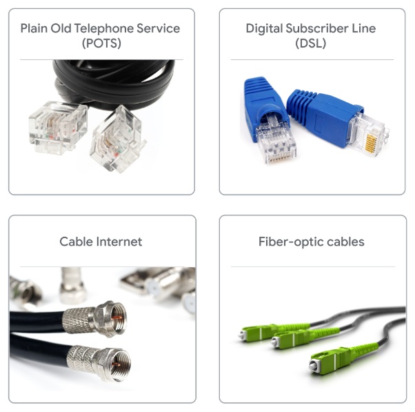
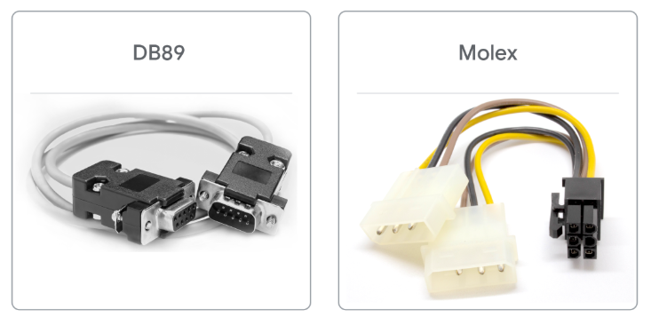
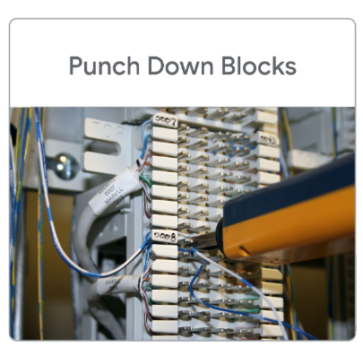

<h1>Supplemental Reading on Connector Types</h1>

<h2>Connector Types</h2>

A computer has many physical ports or connectors. You can use these connectors to connect devices that add functionality to your computing, such as a keyboard, mouse, or monitor. These external devices are called peripherals. IT often works with and troubleshoots these peripherals, so it is helpful to understand the types of connectors. This reading will cover different types of connectors and their uses.  

<h2>USB Connectors</h2>

<h3>USB 2.0, 3.0 & 3.1</h3>

USB connectors transfer data and power to devices connected to a computer. USB connectors are the most popular connectors for all types of peripherals.

There are three generations of USB type A connectors in use today: USB 2.0, 3.0, and 3.1. Here are the differences between the three generations:

- USB 2.0: Black port on the computer, 480 Mbps transfer speed

- USB 3.0: Blue port on computer, 5 Gbps transfer speed

- USB 3.1: Teal port on the computer, 10 Gbps transfer speed

USB ports are backwards compatible, meaning a USB port can connect any of the three generations of USB type A connectors. The connected cable will determine the speed of data transfer. Connecting a USB 3 to a USB 2 port will result in 480 megabits (Mbps) per second of speed.

<h3>Micro USB, USB-C & Lightning Port</h3>

Micro USB, USB-C, USB4 (Thunderbolt), and Lightning Ports are smaller connectors that carry more power than older USB connectors and have faster data transfer speeds. These connectors are used for devices like smartphones, laptops, and tablets.

- Micro USB is a small USB port found on many non-Apple cellphones, tablets, and other portable devices. 

- USB-C is the newest reversible connector with either end having the same build. USB-C cables replace traditional USB connectors since they can carry significantly more power and transfer data at 20 Gbps.  

- USB4 uses Thunderbolt 3 protocol and USB-C cables to transfer data at speeds of 40 Gbps and provide power as well. 

- Lightning Port is a connector exclusive to Apple that is similar to USB-C. It is used for charging and connecting devices to computers, external monitors, cameras and other peripherals.

<h3>Communication Connectors</h2>

Different cable connectors are used to share information between devices and connect to the internet. IT professionals maintain network systems that use different types of communication connectors. 

- <b>Plain Old Telephone Service (POTS)</b> refers to cables transmitting voice through twisted copper pair wires. Landline telephones, dial-up internet, and alarm systems use POTS. The RJ-11 (Register Jack 11) connector is used for POTS.

- <b>Digital Subscriber Line (DSL)</b> provides access to high-speed networks or the internet through telephone lines and a modem. The RJ-45 connects a computer to network elements and is mostly used with ethernet cables. 

- <b>Cable Internet</b> uses a cable TV infrastructure and a modem to provide high-speed internet access to users. An F type connector is commonly used with cable modems. 

- <b>Fiber-optic cables</b> contain strands of glass fibers inside an insulated casing that send data long-distance and allow for higher-bandwidth communication. The major internet providers use fiber-optic cables for high-speed internet service. 

<h2>Device Connectors</h2>

IT professionals will encounter legacy devices that still use older connectors such as DB9 and Molex (please excuse the typo in the picture below).

- <b>DB9 connectors</b> are used for older peripherals like keyboards, mice, and joysticks. An IT professional may still encounter a DB9 connector for external tools a computer uses and should recognize the cable to connect to the appropriate port.

- <b>Molex connectors</b> provide power to drives or devices inside the computer. Molex connectors are used for connecting a hard drive, disc drive (CD-ROM, DVD, Blu-ray), or a video card. 

<h2>Punch Down Blocks</h2>

A punch down block is a terminal strip used to connect telephone or data lines. Punch down blocks are a quick and easy way to connect wiring. IT professionals use punch down blocks to change a wire or make a new connection for a telephone system or Local Area Network (LAN).

These are the most common cables and connectors. As technology advances, these cables and connectors will also change. 

<h2>Key Takeaways</h2>

IT professionals need to be familiar with cables and connectors used to attach peripheral devices to computers. 

- USB connectors are the most common connector type and they transfer data and power to devices connected to a computer. 

- Communication connectors, such as RJ-45 and fiber optic cables, connect devices to the internet and one another.

- IT professionals may encounter legacy devices that use older connectors such as DB89 and Molex.

- Punch down blocks are terminal strips used to connect telephone or data lines.