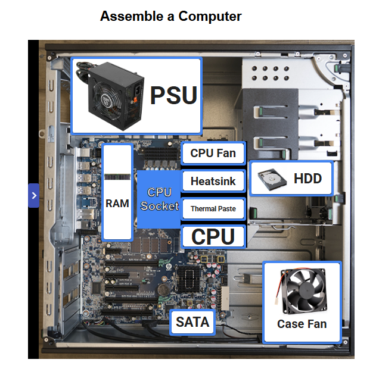

<h1>Proper Assembling of a Computer</h1>

When assembling a real computer, components must be installed in a strict physical and logical sequence to prevent damage:

1. <b>Motherboard Prep:</b> Install the CPU into the motherboard's CPU Socket.
2. <b>Thermal Interface:</b> Apply a small pea-sized drop of Thermal Paste onto the center of the CPU integrated heat spreader.
3. <b>Cooler Installation:</b> Mount the Heatsink and secure the CPU Fan over the processor, plugging its power cable into the CPU_FAN header.
4. <b>Memory:</b> Insert the RAM sticks into the proper dual-channel slots until they click.
5. <b>Case Mounting:</b> Secure the motherboard inside the chassis alongside the PSU, HDD, and Case Fans.
6. <b>Cabling:</b> Connect internal power cables and hook up the SATA data cable from the storage drive to the motherboard.