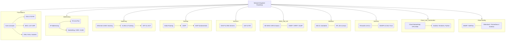

# Network Engineer — Visual Mindmap (Mermaid)

```mermaid
flowchart TB
  A[Network Engineer Roadmap]

  subgraph Foundations
    F1(Core concepts) --> F2(OSI & TCP/IP)
    F1 --> F3(MAC vs IP, ARP)
    F1 --> F4(DNS, Ports, Sockets)
  end

  subgraph Addressing
    I1(IP Addressing) --> I2(IPv4 & IPv6)
    I1 --> I3(Subnetting, CIDR, VLSM)
  end

  subgraph Switching
    S1(Ethernet & MAC learning) --> S2(VLANs & Trunking)
    S2 --> S3(STP & LACP)
  end

  subgraph Routing
    R1(Static Routing) --> R2(OSPF)
    R2 --> R3(BGP fundamentals)
  end

  subgraph Services
    SV1(DHCP & DNS Servers)
    SV2(NAT & PAT)
    SV1 --- SV2
  end

  subgraph WAN_and_HA
    W1(SD-WAN / MPLS basics)
    W2(HSRP / VRRP / GLBP)
    W1 --- W2
  end

  subgraph Security
    Sec1(Firewalls & ACLs)
    Sec2(IDS/IPS & Zero Trust)
    Sec1 --- Sec2
  end

  subgraph Wireless
    Wl1(802.11 standards)
    Wl2(RF, site surveys)
    Wl1 --- Wl2
  end

  subgraph Cloud_and_Automation
    C1(Cloud Networking: VPC/VNet)
    C2(Ansible, Terraform, Python)
    C1 --> C2
  end

  subgraph Observability
    O1(SNMP / NetFlow)
    O2(Wireshark / Prometheus / Grafana)
    O1 --- O2
  end

  A --> Foundations
  A --> Addressing
  A --> Switching
  A --> Routing
  A --> Services
  A --> WAN_and_HA
  A --> Wireless
  A --> Security
  A --> Cloud_and_Automation
  A --> Observability

```

Save and view this file in VS Code (Mermaid preview or a Markdown preview extension).
